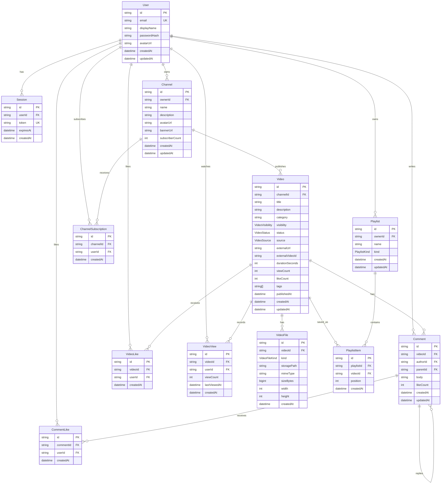

# jjobtub Database ERD

이 문서는 `backend/prisma/schema.prisma` 기준의 데이터베이스 구조를 요약합니다.

## ERD

## 주요 관계

- `User`는 여러 `Channel`, `Playlist`, `Comment`, `Session`을 가질 수 있습니다.
- `Channel`은 여러 `Video`를 발행하고, 여러 `ChannelSubscription`을 받습니다.
- `Video`는 업로드 파일(`VideoFile`), 댓글(`Comment`), 좋아요(`VideoLike`), 시청 기록(`VideoView`), 재생목록 항목(`PlaylistItem`)과 연결됩니다.
- `Playlist`는 사용자 소유이며, `PlaylistItem`을 통해 여러 영상을 포함합니다.
- `Comment`는 `parentId`로 자기 참조 관계를 가져 대댓글 구조를 표현합니다.

## Enum

| Enum | 값 | 설명 |
| --- | --- | --- |
| `VideoVisibility` | `PUBLIC`, `UNLISTED`, `PRIVATE` | 영상 공개 범위 |
| `VideoStatus` | `DRAFT`, `READY`, `PROCESSING`, `FAILED` | 영상 처리 상태 |
| `VideoFileKind` | `ORIGINAL`, `THUMBNAIL`, `HLS_MASTER`, `HLS_VARIANT` | 저장된 파일 종류 |
| `VideoSource` | `LOCAL`, `YOUTUBE` | 로컬 업로드 또는 YouTube 링크 |
| `PlaylistKind` | `LIKED`, `CUSTOM` | 좋아요 표시한 재생목록 또는 사용자 지정 재생목록 |

## 주요 제약

- `User.email`은 고유합니다.
- `Session.token`은 고유합니다.
- `Playlist`는 사용자별 이름이 고유합니다: `(ownerId, name)`.
- `PlaylistItem`은 같은 재생목록에 같은 영상이 중복 저장되지 않습니다: `(playlistId, videoId)`.
- `VideoLike`는 사용자별 영상 좋아요 중복을 막습니다: `(videoId, userId)`.
- `VideoView`는 사용자별 영상 시청 기록을 하나로 누적합니다: `(videoId, userId)`.
- `ChannelSubscription`은 사용자별 채널 구독 중복을 막습니다: `(channelId, userId)`.
- `CommentLike`는 사용자별 댓글 좋아요 중복을 막습니다: `(commentId, userId)`.

## 삭제 정책

대부분의 하위 데이터는 상위 레코드 삭제 시 함께 삭제되도록 `onDelete: Cascade` 관계를 사용합니다. 예를 들어 사용자를 삭제하면 세션, 채널, 재생목록, 좋아요, 댓글 작성 정보가 함께 정리되고, 영상을 삭제하면 파일, 댓글, 좋아요, 시청 기록, 재생목록 항목이 함께 삭제됩니다.
